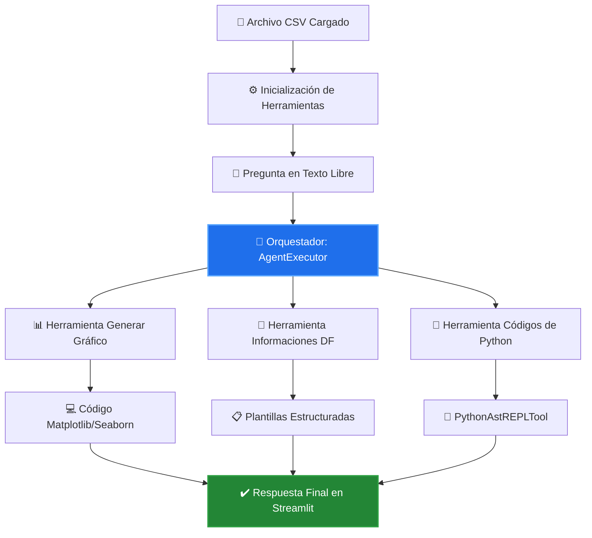

Asistente Inteligente de Análisis y Visualización de Datos
  
  🦜 Agente ReAct Inteligente para Exploración y Análisis Automatizado de Datasets

Este proyecto consiste en un Agente de Inteligencia Artificial basado en el framework LangChain y el razonamiento tipo ReAct (Reasoning and Acting). El sistema está diseñado para actuar como un analista de datos virtual avanzado, permitiendo a los usuarios cargar cualquier archivo en formato CSV y realizar exploraciones profundas, resúmenes estadísticos exhaustivos, consultas personalizadas mediante código dinámico y generación de gráficos a partir de instrucciones en lenguaje natural.

Desarrollado con una arquitectura modular de herramientas (Tools), la aplicación integra un LLM de alto rendimiento a través de Groq para procesar metadatos e interpretar tendencias, aislando los datos locales para garantizar un análisis seguro, eficiente y de nivel profesional.

☁️ Enlaces y Evidencia del Proyecto
Aplicación en Producción (Streamlit Cloud): https://agenteslangchain.streamlit.app

Repositorio en GitHub: [https://github.com/Jaat2222/Agentes_Lang_Chain](https://github.com/Jaat2222/Agentes_Lang_Chain)

🛠️ Arquitectura y Flujo de la Solución
El núcleo del sistema no es un simple script lineal de prompts; implementa un bucle de razonamiento ReAct gestionado por un orquestador que decide dinámicamente qué herramienta especializada ejecutar según la intención del usuario.

### 🔄 Diagrama del Proceso de Ejecución



### 🧠 Detalle de los Componentes Clave:

* **🧠 Orquestador (AgentExecutor):** Implementa una plantilla ReAct en castellano que procesa el estado del DataFrame (`df.head()`) estructurado en formato Markdown. Mantiene un flujo de pensamiento lógico estructurado en `Thought ──► Action ──► Action Input ──► Observation` hasta resolver la consulta de manera definitiva.
* **📄 Herramienta Informaciones DF:** Extrae las dimensiones exactas (`shape`), tipos de datos de las columnas, conteo estricto de valores nulos y cadenas de texto que simulan valores nulos (`'nan'`). Un prompt estructurado obliga al LLM a devolver un informe técnico formal categorizado con sugerencias de limpieza.
* **📊 Herramienta Generar Gráfico:** Un motor avanzado de inyección de código. Toma la petición del usuario, evalúa la estructura de los datos y redacta exclusivamente código Python puro bajo lineamientos estrictos (uso del 100% de los datos, configuraciones de diseño con `sns.despine()` y control cronológico). El backend captura el gráfico y lo renderiza de forma nativa en la interfaz web a través de `st.pyplot()`.
* **🐍 Herramienta Códigos de Python (PythonAstREPLTool):** Un entorno seguro aislado que ejecuta comandos AST de Python directamente sobre el DataFrame local para contestar de forma exacta métricas complejas o filtros combinados (ej. *¿Cuál es el promedio de X columna?*).

## 🧰 Tecnologías y Herramientas Utilizadas

1. **Framework de IA:** LangChain (LCEL) & LangChain Experimental Core.
2. **Modelo de Lenguaje (LLM):** ChatGroq (`llama-3.3-70b-versatile`) con `temperature=0` para asegurar respuestas deterministas y exactas.
3. **Librerías de Análisis y Visualización:** Pandas, Matplotlib, Seaborn y Tabulate.
4. **Interfaz de Usuario:** Streamlit (Layout centrado con estados de sesión y descargas nativas de reportes en Markdown).
5. **Entorno de Configuración:** Python 3.10+ y Python-Dotenv.
🚀 Instrucciones para Ejecución Local y Configuración
Prerrequisitos
Contar con Python 3.10 o superior instalado y disponer de una API Key activa dentro de la plataforma de Groq Cloud.

### 1. Clonar el repositorio
```cmd
git clone [https://github.com/Jaat2222/Agentes_Lang_Chain.git](https://github.com/Jaat2222/Agentes_Lang_Chain.git)
cd Agentes_Lang_Chain
```

### 2. Crear y activar el entorno virtual
En Windows (CMD):
```cmd
python -m venv .venv
.venv\Scripts\activate
```

### 3. Instalar dependencias del proyecto
```cmd
pip install -r requirements.txt
```
### 4. Configurar variables de entorno
Crea un archivo llamado `.env` en la raíz del proyecto y añade tu credencial de Groq:
```env
GROQ_API_KEY=tu_groq_api_key_real_aqui
```

### 5. Ejecutar la aplicación local
```cmd
streamlit run app.py
```
## ☁️ Guía de Despliegue en Streamlit Cloud

Para mantener la aplicación sincronizada y funcionando de manera pública en los servidores de Streamlit Community Cloud:

* **Paso 1: Confirmar cambios locales**
    Asegúrate de confirmar y enviar tus últimas actualizaciones locales a tu repositorio de GitHub mediante la consola de Git (`git add .gitignore`, `git commit`, `git push origin main`).

* **Paso 2: Acceder a la plataforma**
    Accede a share.streamlit.io mediante tu cuenta vinculada de GitHub.

* **Paso 3: Configurar parámetros**
    Configura los parámetros iniciales apuntando al repositorio `Agentes_Lang_Chain`, rama `main` y archivo de ejecución `app.py`.

* **Paso 4: Cargar credenciales seguras**
    Ingresa a la sección Advanced Settings e introduce tu variable de entorno en el apartado de secretos:
    GROQ_API_KEY = "tu_api_key_de_groq_aqui"

* **Paso 5: Desplegar**
    Presiona Deploy. Gracias a la integración con Git y al archivo `.gitignore` configurado, los cambios futuros en `herramientas.py` o `app.py` se desplegarán de forma automatizada en producción.
